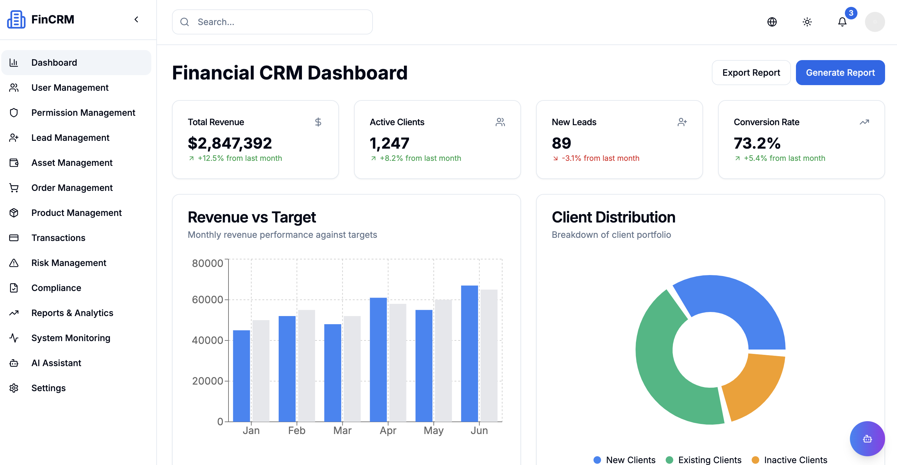

# ExportCRM——外贸出口管理系统

一个现代化的外贸出口客户关系管理系统，集成了客户管理、订单管理、产品管理、物流跟踪、AI助手和表单设计器等核心功能。

## 🚀 快速开始

### 环境要求

- Node.js 18.0 或更高版本
- npm 或 yarn 包管理器

### 安装依赖

\`\`\`bash
npm install
# 或
yarn install
\`\`\`

### 启动开发服务器

\`\`\`bash
npm run dev
# 或
yarn dev
\`\`\`

访问 [http://localhost:3000](http://localhost:3000) 查看应用。

### 演示账户

- 邮箱: `admin@exportcrm.com`
- 密码: `admin123`

## 📋 功能特性

### 🏠 仪表板
- 实时数据展示和KPI监控
- 交互式图表和数据可视化
- 订单状态和物流跟踪监控

### 👥 用户管理
- 完整的用户生命周期管理
- 基于角色的权限控制
- 用户行为追踪和分析

### 🎯 客户管理
- 客户信息管理和跟进
- 销售漏斗和转化分析
- 自动化营销工具

### 📦 订单管理
- 订单创建、编辑和跟踪
- 订单状态实时更新
- 订单统计和报表分析

### 🛍️ 产品管理
- 产品信息管理
- 库存管理和跟踪
- 产品分类和定价

### 🚚 物流管理
- 物流信息跟踪
- 运输状态监控
- 物流成本分析

### 🛡️ 合规与风险
- 出口合规检查
- 风险预警和监控
- 文档管理和审计追踪

### 🤖 AI助手
- 智能客户服务
- 数据分析和洞察
- 市场趋势预测

### 📝 表单设计器
- 拖拽式表单设计
- 20+种表单组件
- 实时预览和导出功能
- 自定义背景和样式

## 🛠️ 技术栈

- **前端框架**: Next.js 14 (App Router)
- **开发语言**: TypeScript
- **UI组件**: shadcn/ui + Radix UI
- **样式框架**: Tailwind CSS
- **图表库**: Recharts
- **拖拽功能**: react-dnd
- **状态管理**: React Context + Hooks

## 📁 项目结构

\`\`\`
├── app/                    # Next.js页面和路由
├── components/             # 可复用组件
│   ├── ui/                # 基础UI组件
│   ├── layout/            # 布局组件
│   └── form-designer/     # 表单设计器组件
├── hooks/                 # 自定义React Hooks
├── lib/                   # 工具函数和配置
├── types/                 # TypeScript类型定义
├── public/                # 静态资源
└── docs/                  # 项目文档
\`\`\`

## 🌐 国际化

系统支持中英文双语：
- 中文 (简体)
- English

## 🎨 主题系统

- 浅色模式
- 深色模式
- 系统自动切换

## 📱 响应式设计

完美支持：
- 桌面端 (1200px+)
- 平板端 (768px-1199px)
- 移动端 (<768px)

## 🔧 开发命令

\`\`\`bash
# 开发模式
npm run dev

# 构建生产版本
npm run build

# 启动生产服务器
npm run start

# 代码检查
npm run lint

# 类型检查
npm run type-check
\`\`\`

## 📦 部署

### Vercel部署 (推荐)

1. 将代码推送到GitHub
2. 在Vercel中导入项目
3. 自动部署完成

### Docker部署

\`\`\`bash
# 构建镜像
docker build -t export-crm .

# 运行容器
docker run -p 3000:3000 export-crm
\`\`\`

## 🤝 贡献指南

1. Fork 项目
2. 创建功能分支 (`git checkout -b feature/AmazingFeature`)
3. 提交更改 (`git commit -m 'Add some AmazingFeature'`)
4. 推送到分支 (`git push origin feature/AmazingFeature`)
5. 创建 Pull Request

## 📄 许可证

本项目采用 MIT 许可证 - 查看 [LICENSE](LICENSE) 文件了解详情。

## 📞 联系我们

如有问题或建议，请通过以下方式联系：

- 邮箱: xujiang156@qq.com
- 微信联系: cxzk_168
- 技术公众号: 趣谈AI

## 🙏 致谢

感谢所有为这个项目做出贡献的开发者和设计师。

---

⭐ 如果这个项目对您有帮助，请给我一个星标！
